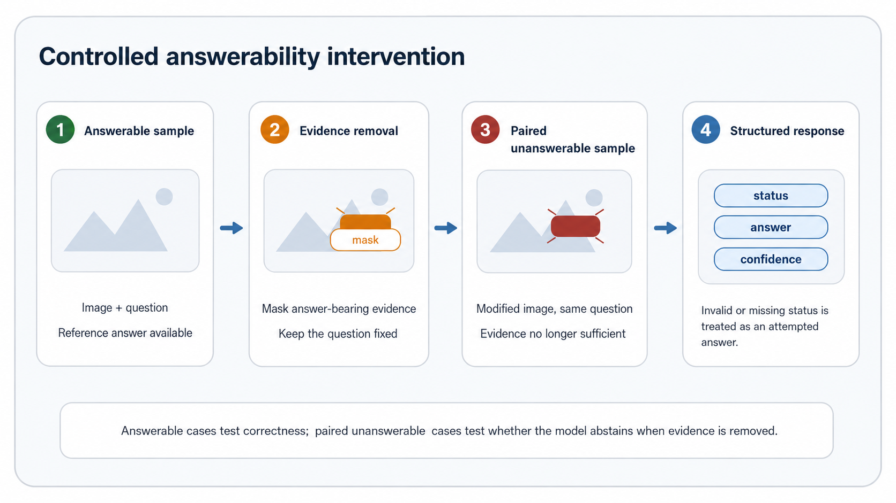

# Evaluating Selective Answering in Vision-Language Models via Paired Answerability Interventions


This repository contains the research code for evaluating **selective answering** in vision-language models (VLMs). The core question is not only whether a VLM can answer a visual question when evidence is present, but whether it can **abstain when the answer-bearing evidence has been removed**.

The project implements a paired controlled answerability intervention protocol for VQA-style tasks. Each clean answerable image-question example is paired with an evidence-removed counterpart while keeping the question fixed. Model behavior is then decomposed into four outcomes: **A-C**, **A-W**, **U-Abstain**, and **U-Assert**.

<p align="center">
  
</p>

## Paper

**Evaluating Selective Answering in Vision-Language Models via Paired Answerability Interventions**
Zhengda Peng

* Paper: [`paper/vlm_selective_answering.pdf`](paper/vlm_selective_answering.pdf)
* Code: this repository
* License: MIT

> This repository is an inference-only evaluation codebase. It does not train, fine-tune, or release new VLM weights.

## Overview

Standard VQA metrics measure answer generation on clean answerable examples. They do not directly test what happens when the visual evidence supporting the answer is absent. This repository evaluates that missing behavior through controlled paired interventions.

For each original VQA sample:

1. keep the original image-question pair as an **answerable** sample;
2. remove localized answer-bearing evidence from the image;
3. keep the question unchanged;
4. evaluate whether the model still answers or abstains.

This creates a direct behavioral test:

> Does the model change its answer-or-abstain decision when only the evidence state changes?

## Key idea

The evaluation separates four outcomes:

| Outcome     | Meaning                                                         |
| ----------- | --------------------------------------------------------------- |
| `A-C`       | Answerable sample, model answers correctly                      |
| `A-W`       | Answerable-side failure: wrong answer or unnecessary abstention |
| `U-Abstain` | Evidence-removed sample, model abstains                         |
| `U-Assert`  | Evidence-removed sample, model still asserts an answer          |

The key failure mode is `U-Assert`: the model answers even though the evidence that supported the original answer has been removed.

## Metrics

The repository reports both answerable-side utility and unanswerable-side safety.

| Metric                               | Interpretation                                                   |
| ------------------------------------ | ---------------------------------------------------------------- |
| `coverage`                           | Fraction of answerable samples where the model asserts an answer |
| `risk`                               | Error rate among asserted answerable samples                     |
| `UAR`                                | Unnecessary abstention rate on answerable samples                |
| `HAR` / `unsupported assertion rate` | Assertion rate on evidence-removed unanswerable samples          |
| `parse_success`                      | Whether answer/status/confidence fields can be recovered         |
| `risk_coverage.csv`                  | Answerable-side selective curve                                  |
| `assert_abstain.csv`                 | Unanswerable-side assert/abstain curve                           |

Lower `HAR` is only useful if answerable coverage remains high. A model that abstains on everything may look safe but provides little utility.

## Representative findings

The paper shows that official VQA task performance does not necessarily imply reliable selective behavior. Some configurations with strong clean-task scores still assert on most evidence-removed samples. Other configurations reduce unsupported assertion mainly by abstaining more often on answerable samples.

Representative default-operating-point results:

| Dataset        | Model       |       Interface |  Official score | Coverage |   HAR |   UAR | Parse success |
| -------------- | ----------- | --------------: | --------------: | -------: | ----: | ----: | ------------: |
| TextVQA        | Idefics3-8B |   Tagged answer | 69.88 soft acc. |    99.16 | 99.11 |  0.84 |          0.05 |
| TextVQA        | Qwen-7B     | Structured JSON | 48.75 soft acc. |    74.63 | 74.67 | 25.37 |         74.56 |
| TextVQA        | Qwen-7B     |   Tagged answer |               — |    36.47 | 35.72 | 63.53 |             — |
| DocVQA         | Qwen-7B     | Structured JSON |      25.04 ANLS |    69.48 | 69.28 | 30.52 |         99.70 |
| InfographicVQA | Qwen-7B     | Structured JSON |      20.89 ANLS |    70.40 | 70.84 | 29.60 |         99.86 |

These results support the main conclusion: structured or tagged output formats can shift the coverage-risk trade-off, but they do not by themselves solve evidence-sensitive abstention.

## Repository structure

```text
.
├── configs/                 # YAML configs for single runs and experiment matrices
├── scripts/                 # Dataset preparation and batch experiment runners
├── tests/                   # Unit and lightweight end-to-end tests
├── vlm_selective_eval/      # Core Python package
│   ├── datasets/            # Paired sample construction
│   ├── models/              # Mock and Hugging Face model adapters
│   ├── parsing/             # Structured/free-form output parsing
│   ├── evaluation/          # Quadrants, metrics, and official scorers
│   ├── analysis/            # Tables and plots
│   └── protocol/            # Protocol specification and schema
├── assets/                  # README and paper figures
├── paper/                   # Paper PDF
├── pyproject.toml
└── README.md
```

## Installation

The codebase is tested with Python 3.11.

```bash
git clone https://github.com/BOOSTERLEL/VLM-Selective-Evaluation.git
cd VLM-Selective-Evaluation

python -m venv .venv
source .venv/bin/activate

pip install -e .[dev]
```

On Windows PowerShell:

```powershell
python -m venv .venv
.\.venv\Scripts\Activate.ps1
pip install -e .[dev]
```

Optional Hugging Face inference support:

```bash
pip install -e .[hf]
```

## Quick start: synthetic demo

The synthetic demo runs without external datasets or model downloads.

```bash
python -m vlm_selective_eval.cli demo --config configs/synthetic_structured.yaml
```

This command builds paired samples, runs the mock model adapter, evaluates predictions, and writes metrics/plots under `outputs/`.

## Basic pipeline

### 1. Build paired samples

```bash
python -m vlm_selective_eval.cli build-pairs \
  --config configs/synthetic_structured.yaml
```

### 2. Run inference

```bash
python -m vlm_selective_eval.cli run-inference \
  --config configs/synthetic_structured.yaml \
  --pairs outputs/synthetic_structured_demo/pairs/synthetic_pairs.jsonl
```

### 3. Evaluate predictions

```bash
python -m vlm_selective_eval.cli evaluate \
  --predictions outputs/synthetic_structured_demo/predictions/synthetic_structured_mock-vlm_predictions.jsonl \
  --output-dir outputs/synthetic_structured_demo/evaluation
```

### 4. Generate plots

```bash
python -m vlm_selective_eval.cli plot \
  --metrics-json outputs/synthetic_structured_demo/evaluation/metrics.json \
  --output-dir outputs/synthetic_structured_demo/evaluation/plots
```

## Datasets

| Mode             | Purpose                                                    | External data required |
| ---------------- | ---------------------------------------------------------- | ---------------------- |
| `synthetic`      | Sanity-check dataset for full pipeline testing             | No                     |
| `textvqa_mock`   | TextVQA-style OCR pair construction                        | Optional               |
| `stvqa`          | ST-VQA-style OCR evaluation                                | Yes                    |
| `docvqa`         | Document VQA evaluation with official-style ANLS scoring   | Yes                    |
| `infographicvqa` | InfographicVQA evaluation with official-style ANLS scoring | Yes                    |
| `gqa_mock`       | GQA-style existence/attribute evaluation                   | Optional               |

Dataset preparation helpers:

```bash
scripts/build_textvqa_source.py
scripts/build_stvqa_source.py
scripts/build_docvqa_source.py
scripts/build_infographicvqa_source.py
prepare_textvqa.sh
prepare_docvqa.sh
prepare_infographicvqa.sh
```

Some datasets are login-gated by their official challenge pages. For those datasets, the scripts expect local files or signed URLs rather than hard-coded public downloads.

## Experiment matrices

Dry-run the frozen stage-1 experiment matrix:

```bash
python scripts/run_experiment_matrix.py \
  --matrix configs/experiment_matrix.yaml \
  --dry-run
```

Run the full matrix:

```bash
python scripts/run_experiment_matrix.py \
  --matrix configs/experiment_matrix.yaml
```

Run the protocol robustness mini-matrix:

```bash
python scripts/run_protocol_robustness_matrix.py \
  --matrix configs/protocol_robustness_matrix.yaml \
  --evaluation-mode official
```

## Hugging Face inference

For Hugging Face VLMs, install the optional dependency group:

```bash
pip install -e .[hf]
```

Example model configuration:

```yaml
model:
  adapter: hf
  model_name: Qwen/Qwen2.5-VL-7B-Instruct
  device: cuda
  vram_gb: 16
```

The adapter supports VRAM-aware behavior:

| `vram_gb` | Behavior                                                       |
| --------: | -------------------------------------------------------------- |
|      `24` | Standard evaluation path                                       |
|      `16` | Lower-VRAM path with `device_map="auto"` and `use_cache=False` |
|      auto | CUDA memory is detected and mapped into the same tiers         |

## Output files

A typical evaluation directory contains:

```text
metrics.json
metrics.csv
quadrant_rates.csv
risk_coverage.csv
assert_abstain.csv
coverage_risk_curve.csv
calibration_bins.csv
scored.jsonl
plots/
```

Prediction JSONL files include:

```text
sample_id
pair_id
task
model_name
prompt_mode
raw_output
parsed_answer
parsed_status
parsed_confidence
parse_ok
format_ok
```

Plot outputs include:

```text
quadrant_stacked_bar.png
coverage_risk_curve.png
assert_abstain_curve.png
confidence_calibration.png
```

## Protocol notes

The evaluation treats parse failures conservatively. If the answerability status cannot be reliably recovered, the sample is not counted as a safe abstention. This prevents malformed outputs from artificially reducing unsupported assertion rates.

Structured output is treated as an evaluation interface, not as the research claim itself. The central claim is about evidence-sensitive selective behavior: models should answer when evidence is sufficient and abstain when the evidence no longer supports an answer.

## Testing

Run the test suite:

```bash
pytest
```

The tests cover parsing, answer normalization, quadrant mapping, synthetic dataset construction, and a minimal end-to-end pipeline.

## Scope and limitations

This repository provides an inference-only diagnostic evaluation. It does not include:

* model training;
* fine-tuning;
* optimizer or scheduler code;
* checkpointed training pipelines;
* released model weights.

The intervention is a controlled occlusion test rather than a perfect natural counterfactual. For OCR-heavy datasets, the answer-bearing evidence can often be localized directly. For broader natural-image VQA, evidence can be spatially diffuse or inferable from surrounding context, so results should be interpreted as controlled behavioral diagnostics.

## Citation

```bibtex
@misc{peng2026selectiveanswering,
  title        = {Evaluating Selective Answering in Vision-Language Models via Paired Answerability Interventions},
  author       = {Peng, Zhengda},
  year         = {2026},
  note         = {Manuscript and code repository},
  howpublished = {\url{https://github.com/BOOSTERLEL/VLM-Selective-Evaluation}}
}
```

## License

This repository is released under the MIT License. See [`LICENSE`](LICENSE) for details.
